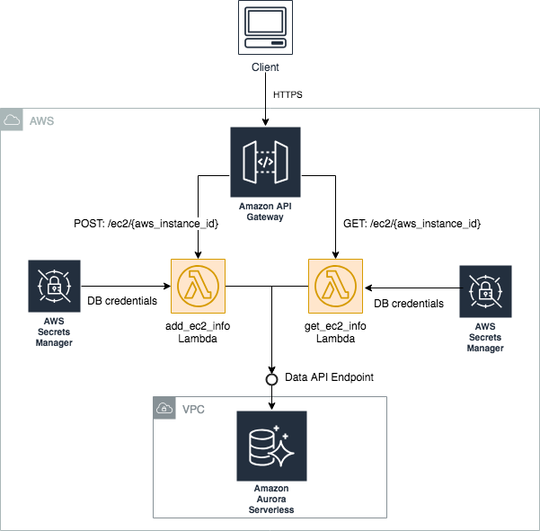

    Project: Simple EC2 Inventory Serverless API
    Author: Marcilio Mendonca (marcilio@amazon.com)
    Date: March, 2019

## Intro


This project is the result of a real ProServe engagement (customer fully anonymized and code modified). Its purpose is to provide a detailed walkthrough and entirey via code of how to leverage Amazon Aurora Serverless and the Data API to build a Serverless SAM API on AWS (API Gateway + Lambda). ProServe consultants, SAs, TAMs, and other technical folks at AWS can greatly benefit from this project and leverage the provided code to help other AWS customer with similar requirements.

## Limitations

As of today (March 2019), the Data API (still in Beta) is only available in ```us-east-1``` and requires the latest boto3 version (which is already packaged as part of the Lambda packagin.). So, __please make sure you deploy this project in ```us-east-1```___.

## Architecture



The architecture of the simple EC2 Inventory Serverless API solution discussed in this post is illustrated above. Client applications send REST requests to the Amazon [API Gateway](https://aws.amazon.com/api-gateway/) endpoint which then routes the request to the appropriate Lambda function depending on the API call. The [Lambda](https://aws.amazon.com/lambda/) functions implement the core API logic and make use of database credentials (eg, user and password) stored on AWS Secrets Manager to connect to the Data API Endpoint for the [Aurora serverless](https://aws.amazon.com/rds/aurora/serverless/) cluster. By leveraging the Data API, Lambda functions do not have to manage database connections or connection pools reducing logic complexity. Instead, simple API calls are made to execute SQL statements individually or in batch against the Aurora Serverless MySQL database cluster. 

An advantage of using Aurora Serverless is the context of this simple EC2 inventory API is the fact that the database cluster does not need to be up and running 24x7. In fact, this makes perfect sense as the EC2 inventory database is only updated when an EC2s is being launched or terminated which might be a sporadic event. The database will be shut down automatically and seamlessly if there is not activity (eg, a Lambda interaction with the database) for a certain amount of time and be restored when needed. In addition, if a very large amount of EC2s are launched in a very short period of time, the Aurora Serverless database will automatically scale to meet traffic demands without requiring any additional logic coded in the Lambda functions (same for scale down events).

## Required software

You'll need to download and install the following software:

* [AWS CLI](https://aws.amazon.com/cli/)
* [Python 3.6](https://www.python.org/downloads/)
* [Pipenv](https://pypi.org/project/pipenv/)

Make sure you have set up AWS credentials (typically placed under `~/.aws/credentials` or `~/.aws/config`). The credentials you're using should have "enough" privileges to provision all required services. You'll know the exact definition of "enough" when you get "permission denied" errors :)


## Python environment

Create the Python virtual environment and install the dependencies:

```
# from the project's root directory
pipenv --python 3.6
pipenv shell # enter the virtual environment
pipenv install (this will use the provided Pipfile to install dependencies)
```

To know where the virtual environments and the dependencies are installed type this:

```
pipenv --venv
```

## Deploying the Solution

### Deploying the Database

This uses the values from config file ```config-dev-env.sh```. 
__Important__: This file will be used everywhere! Make sure you edit the file with config value for your AWS account!

Now deploy the database resources like this (__important__: Notice that we only specify the prefix of the config file `config-dev` not the full file name).
)

```bash
# from project's root directory
./deploy_scripts/deploy_rds.sh config-dev
```

### Creating the Database entities (database and tables)

```bash
# from project's root directory
cd deploy_scripts/ddl_scripts
# run the script
./create_schema.sh config-dev
```

### Deploying the API

```bash
# from the project's root directory
./deploy_scripts/package_api.sh config-dev && ./deploy_scripts/deploy_api.sh config-dev
```

Notice that we only specify the prefix of the file `cmdb-dev` not the full file name.

## APIs

You can use [Postman](https://www.getpostman.com/downloads/) or ```curl``` to test the APIs.

Use the AWS Console to find out the API Endpoint for the stage named by variable ```api_stage_name``` in the ```config-dev-env.sh``` file.

### Add EC2 info to inventory
 
#### Request

POST: https://[Api-EndPoint]/ec2/{aws_instance_id}

Example:
```
POST: /ec2/instance-002
{
    "aws_region": "123456789012", 
    "aws_account": "123456789012",
    "packages": [
    	{"package_name": "package-1", "package_version": "v1"},
    	{"package_name": "package-1", "package_version": "v2"},
    	{"package_name": "package-2", "package_version": "v1"},
    	{"package_name": "package-3", "package_version": "v1"}
    ]
}
```

#### Response

**Success - HttpCode=200**

Example:

```
{
    "new_record": {
        "aws_account": "123456789012",
        "aws_region": "us-east-1",
        "packages": [
            {
                "package_name": "package-1",
                "package_version": "v1"
            },
            {
                "package_name": "package-1",
                "package_version": "v2"
            },
            {
                "package_name": "package-2",
                "package_version": "v1"
            }
        ]
    }
}
```

**Error - HttpCode=400**

Example:

```
{
    "error_message": "An error occurred (BadRequestException) when calling the ExecuteSql operation: Duplicate entry 'instance-002' for key 'PRIMARY'"
}
```

### Get EC2 info from inventory (includes packages)

#### Request

```
GET: https://[Api-EndPoint]/ec2/{aws_knstance_id}
```

Example:
```
GET: /ec2/instance-002
```

#### Response

**Success - HttpCode=200 (AMI found)**

Example:

```
{
    "record": {
        "aws_instance_id": "instance-002",
        "aws_region": "us-east-1",
        "aws_account": "123456789012",
        "creation_date_utc": "2019-03-06 02:45:32.0",
        "packages": [
            {
                "package_name": "package-2",
                "package_version": "v1"
            },
            {
                "package_name": "package-1",
                "package_version": "v2"
            },
            {
                "package_name": "package-1",
                "package_version": "v1"
            }
        ]
    },
    "record_found": true
}
```

**Success - HttpCode=200 (EC2 not found)**

{
    "record": {},
    "record_found": false
}

**Error - HttpCode=400**

Example:

```
{
    "error_message": "Some error message"
}
```

## Questions on Comments?

Please contact Marcilio Mendonca (marcilio@amazon.com) if you have any questions or comments.