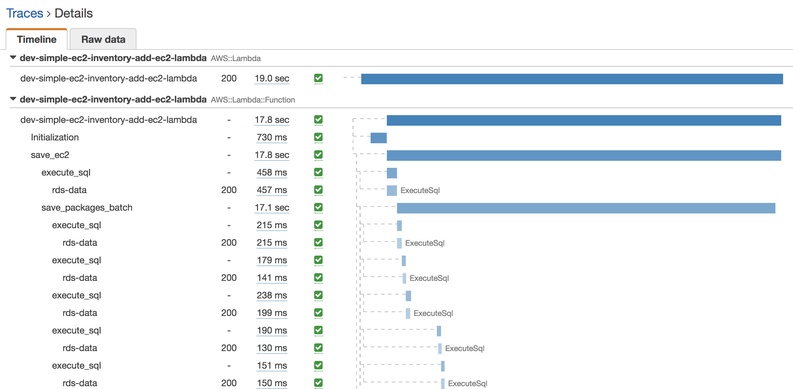
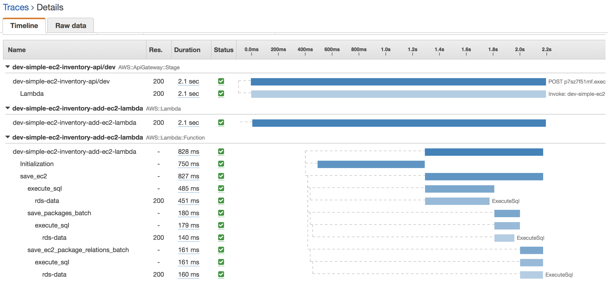

## Intro

This project provides comprehensive sample code that shows how to leverage Amazon Aurora Serverless and the Data API to build connectionless Serverless applications on AWS.

Please check the corresponding [AWS Blog Post](TODO) for further details.

## Limitations

As of now (March 2019), the Data API (still in Beta) is only available in ```us-east-1``` and requires the latest boto3 version (which is already packaged as part of the Lambda packagin.). So, __please make sure you deploy this project in ```us-east-1```__.

## Architecture


The architecture of the simple EC2 Inventory Serverless API solution discussed in our [Blog Post](TODO) is shown above. Client applications send REST requests to a provisioned [Amazon API Gateway](https://aws.amazon.com/api-gateway/) endpoint which then routes the request to the appropriate Lambda function based on the type of API call. The [Lambda](https://aws.amazon.com/lambda/) functions implement the core API logic and make use of database credentials stored on AWS Secrets Manager to connect to the Data API Endpoint for the [Aurora serverless](https://aws.amazon.com/rds/aurora/serverless/) MySQL cluster. By leveraging the Data API, Lambda functions do not have to manage database connections or connection pools. Instead, simple API calls are made via the Data API to issue SQL commands to the Aurora Serverless database.

By using Aurora Serverless we can take advantage of the optional auto-pause feature which allows us to automatically and seamlessly shut down and restart the database when needed without any impact to application code. This makes sense as the EC2 Inventory database will only be updated sporadically when EC2 instances are launched or terminated. In the occasional event of a large number of EC2 instances being launched simultaneously, the Aurora Serverless database will automatically scale up to meet traffic demands.

## Required software

You'll need to download and install the following software:

* [Python 3.6](https://www.python.org/downloads/)
* [Pipenv](https://pypi.org/project/pipenv/)
* [AWS CLI](https://aws.amazon.com/cli/)
* [AWS SAM CLI](https://docs.aws.amazon.com/serverless-application-model/latest/developerguide/serverless-sam-cli-install.html)

Make sure you have set up AWS credentials (typically placed under `~/.aws/credentials` or `~/.aws/config`). The credentials you're using should have "enough" privileges to provision all required services. You'll know the exact definition of "enough" when you get "permission denied" errors :)

Now, indicate which AWS profile should be used by the provided scripts, e.g,:

```bash
export AWS_PROFILE=[your-aws-profile]
```

## Python environment

Create the Python virtual environment and install the dependencies:

```bash
# from the project's root directory
pipenv --python 3.6 # creates Python 3.6 virtual environment
pipenv shell    # activate the virtual environment
pipenv install  # install dependencies
```

To know where the virtual environments and the dependencies are installed type this:

```bash
pipenv --venv
```

## Deploying the Solution

### Deploying the Database

The deployment script reads the values from config file ```config-dev-env.sh``` (__important__: This file will be used everywhere! Make sure you edit the file with config value for your AWS account!).

Now deploy the database resources by invoking the deploy script and passing the config file as an input parameter (__important__: Notice that we only specify the prefix of the config file (eg, `config-dev`) not the full file name).

```bash
# from project's root directory
./deploy_scripts/deploy_rds.sh config-dev
```

### Creating the Database entities (database and tables)

```bash
# from project's root directory
cd deploy_scripts/ddl_scripts
# run the script
./create_schema.sh config-dev
```

### Deploying the API

```bash
# from the project's root directory
./deploy_scripts/package_api.sh config-dev && ./deploy_scripts/deploy_api.sh config-dev
```

## APIs

Use the AWS Console to find out the API Endpoint for the stage named by variable ```api_stage_name``` in the ```config-dev-env.sh``` file.

Once you know the API endpoint, you can use [Postman](https://www.getpostman.com/downloads/) or ```curl``` to invoke and test the APIs.

### Add EC2 info to inventory

Add a new EC2 to the inventory by specifying the EC2 instance id (```aws_instance_id```), AWS region, and AWS account as well as the packages that have been deployed to the instance (```package_name``` and ```package_version```).

#### Request

```POST: https://[Api-EndPoint]/ec2/{aws_instance_id}```

Example:

```
POST: /ec2/i-01aaae43feb712345
{
    "aws_region": "us-east-1",
    "aws_account": "123456789012",
    "packages": [
    	{"package_name": "package-1", "package_version": "v1"},
    	{"package_name": "package-1", "package_version": "v2"},
    	{"package_name": "package-2", "package_version": "v1"},
    	{"package_name": "package-3", "package_version": "v1"}
    ]
}
```

#### Responses

**Success - HttpCode: 200**

Example:

```
{
    "new_record": {
        "aws_account": "123456789012",
        "aws_region": "us-east-1",
        "packages": [
            {
                "package_name": "package-1",
                "package_version": "v1"
            },
            {
                "package_name": "package-1",
                "package_version": "v2"
            },
            {
                "package_name": "package-2",
                "package_version": "v1"
            }
        ]
    }
}
```

**Error - HttpCode: 400**

Example:

```
{
    "error_message": "An error occurred (BadRequestException) when calling the ExecuteSql operation: Duplicate entry 'instance-002' for key 'PRIMARY'"
}
```

### Get EC2 info from inventory (includes packages)

Get information about an EC2 from the inventory by specifying the EC2 instance id (```aws_instance_id```).

#### Request

```
GET: https://[Api-EndPoint]/ec2/{aws_instance_id}
```

Example:
```
GET: /ec2/i-01aaae43feb712345
```

#### Response

**Success - HttpCode=200 (AMI found)**

Example:

```
{
    "record": {
        "aws_instance_id": "i-01aaae43feb712345",
        "aws_region": "us-east-1",
        "aws_account": "123456789012",
        "creation_date_utc": "2019-03-06 02:45:32.0",
        "packages": [
            {
                "package_name": "package-2",
                "package_version": "v1"
            },
            {
                "package_name": "package-1",
                "package_version": "v2"
            },
            {
                "package_name": "package-1",
                "package_version": "v1"
            }
        ]
    },
    "record_found": true
}
```

**Success - HttpCode=200 (EC2 not found)**

{
    "record": {},
    "record_found": false
}

**Error - HttpCode=400**

Example:

```
{
    "error_message": "Some error message"
}
```

## Observability

We enabled observability of this application via [AWS X-Ray](https://aws.amazon.com/xray/). Take a look at source file ```lambdas/helper/dal.py``` in and search for the ```x-ray``` and ```xray``` keywords to find observability-related logic.

With the help of X-Ray we were able to identify bottlenecks and fix them. For example, we noticied from the X-Ray Service Graph in the AWS Console that when saving an EC2 record referencing 100 package objects (name, version) Lambda was taking about 18 secs in total to store each individual package in Aurora Serverless (ie, 1 package = 1 Data API call). We then built batch versions for persisting packages and package relations (see methods ```_save_packages_batch``` in the source code and ```_save_ec2_package_relations_batch```) that batch insert up to 200 SQL statement into a single Data API call (200 packages = 1 Data API call). This reduced the overall time to persist 100 package objects from 18 secs (one at time) to 828ms (single batch)!

The picture below depicts X-Ray telling us that calling the Data API individually for every EC2 package that we want to store in Aurora Serverless is not a good idea (takes 17.1 secs).



And then we tuned our batch insert method to use a single API call to batch insert all package objects at once and things look much better... 180ms. :)



We also used batching to persist EC2-Package relations (161 ms).

Thanks for the hand AWS X-Ray!

## Running the Lambdas Locally (experimental)

To run Lambda function ```GetEC2InfoLambda``` locally using the environment variables defined in ```local/env_variables.json``` and the event input file ```GetEC2InfoLambda-event.json``` do the following:

```
# from the project's root directory
local/run_local.sh config-dev GetEC2InfoLambda
```

## License Summary

This sample code is made available under a modified MIT license. See the LICENSE file.
